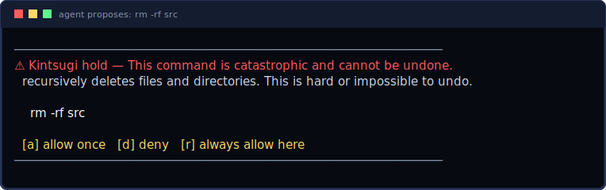

# The Tier-2 model (Phase 2)



Aegis's decision to **block** a catastrophic command is always deterministic
rules. The model never makes that call. Its only jobs are to **explain** (a
one-sentence summary for the hold card) and to **score** the *ambiguous band*
(a `risk` 0–100), which drives graduated unattended mode. Its influence is
escalation-only: it can add caution, never unlock a rule-based block, and `Safe`
commands stay on a model-free fast path.

## Backends

| backend | when | needs |
|---------|------|-------|
| `HeuristicScorer` | **default** | nothing — deterministic, offline, always available |
| `LlamaScorer` | `--features llama` | a C/C++ toolchain to build `llama.cpp` |

The heuristic backend is also the graceful-degradation path: if the real model
can't load, Aegis keeps working with rules + heuristic scoring.

## Running with the real model

```sh
# 1) Pin the weights in crates/aegis-model/src/manage.rs (set url + sha256).
# 2) Build with inference + download enabled:
cargo build --release -p aegis-daemon --features "aegis-model/llama aegis-model/download"
# 3) Weights auto-select by RAM (3B if >= ~6 GB, else the 1.5B fallback),
#    download once (checksum-verified), and stay warm in the daemon.
```

Override the weights directory with `AEGIS_MODEL_DIR`. Weights are **pinned by
SHA-256**; an unpinned spec is refused rather than loading an unverified blob.

## How it affects decisions

- **Safe** → never scored (fast path).
- **Ambiguous** → `summary` + `risk` filled (`tier = 2`).
  - *Attended:* still held; the model just explains and shows a risk meter.
  - *Unattended (graduated):* `risk < threshold` → allow + record; `>=` → deny +
    queue. Threshold defaults to 50; set per repo in `.aegis.toml`:
    ```toml
    mode = "unattended"
    threshold = 35
    ```
- **Catastrophic** → summarized for the hold card, but the decision is unchanged
  (held in attended, denied in unattended) **regardless of the score**.
